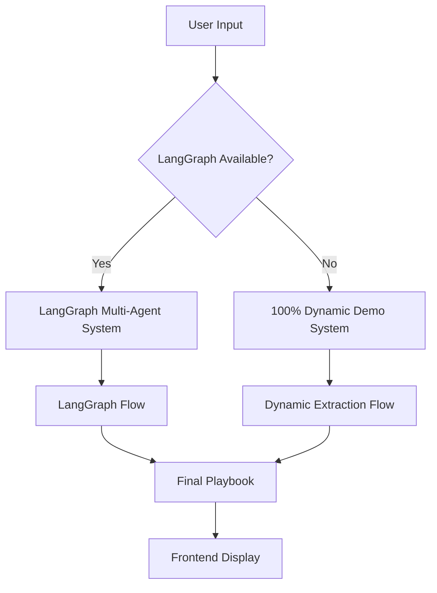
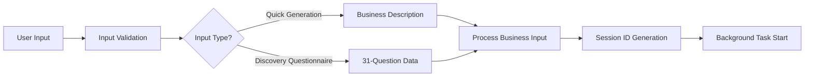
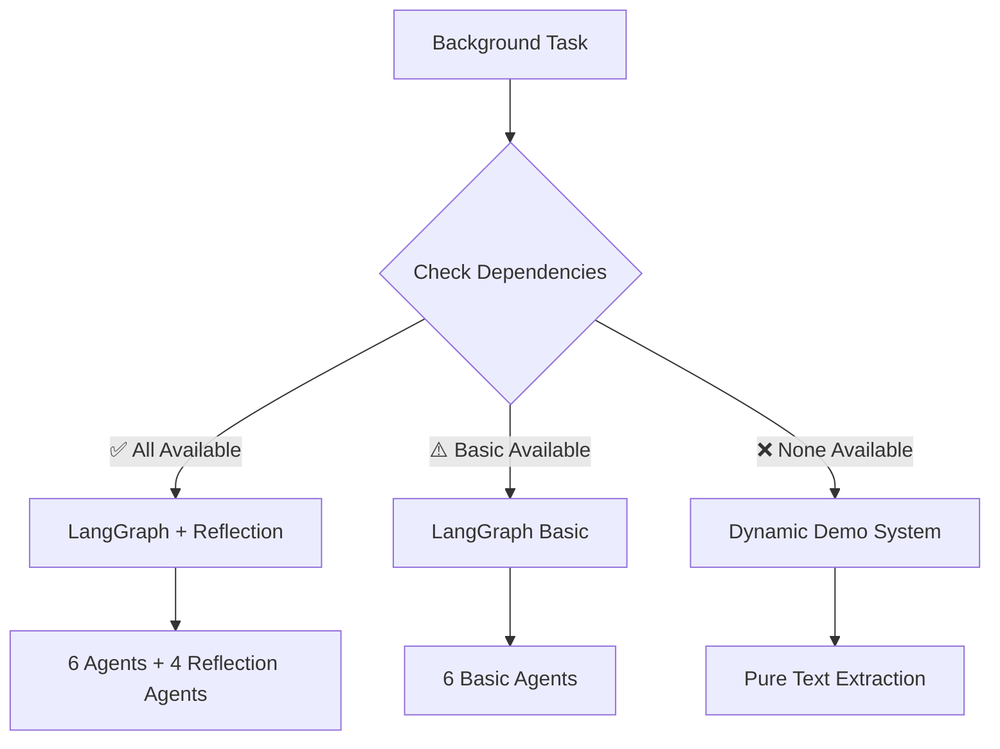
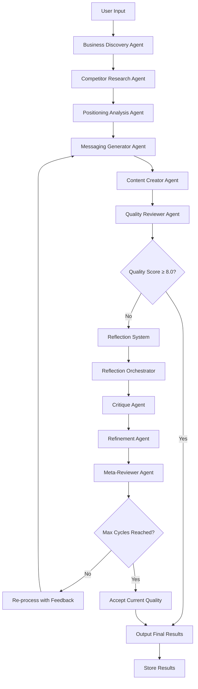
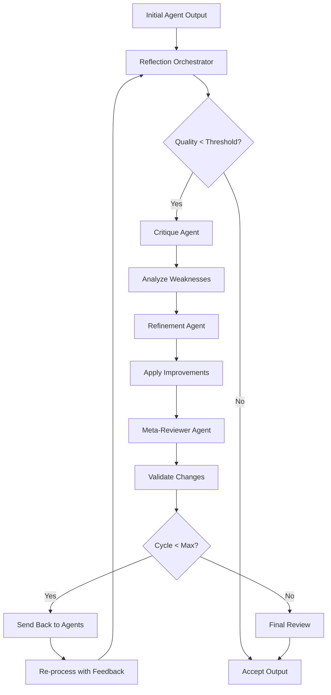
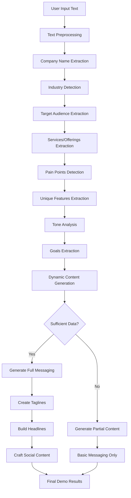
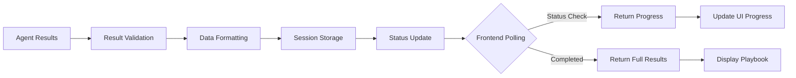
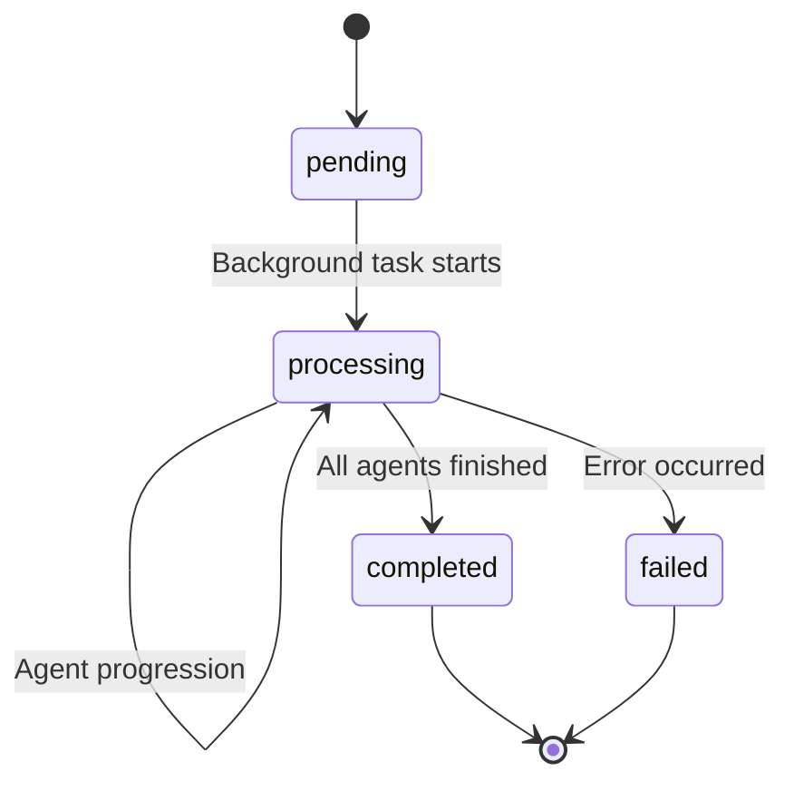
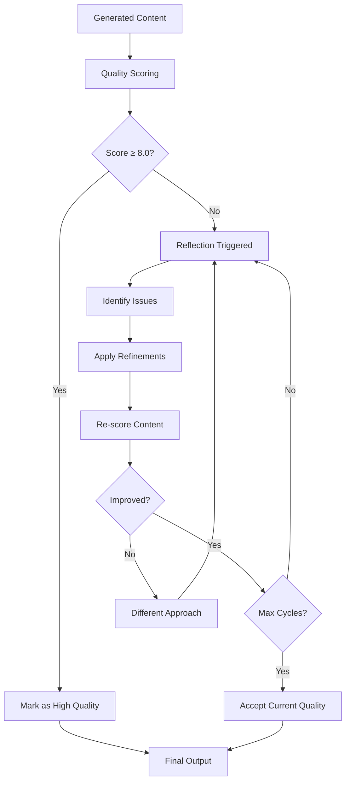
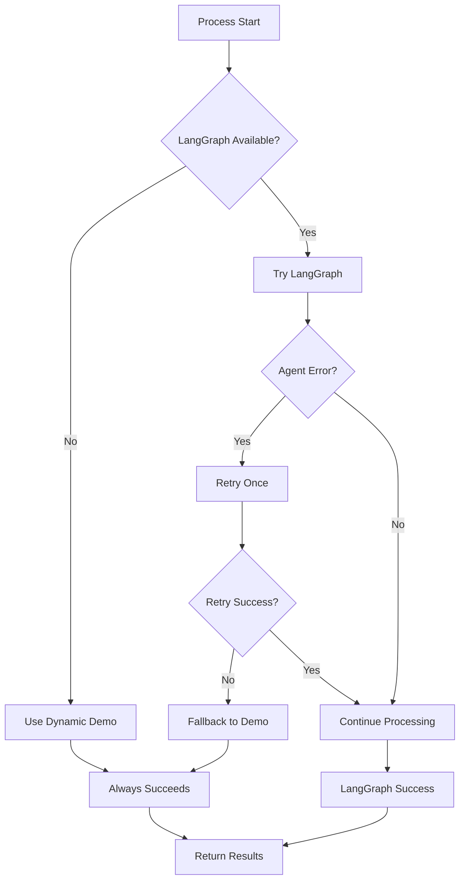

# 🤖 MessageCraft AI Flow Path

## System Architecture Overview



## 🔄 Complete AI Processing Flow

### **Phase 1: Input Processing & Validation**



### **Phase 2: Agent System Selection**



---

## 🚀 LangGraph Multi-Agent Flow Path

### **Phase 3A: LangGraph Agent Pipeline**



### **Detailed Agent Responsibilities**

#### 🔍 **Agent 1: Business Discovery**
```
Input: Business description + questionnaire data
Process: 
├── Extract company profile
├── Identify industry & market
├── Define target audience
├── Analyze business model
└── Map value propositions

Output: Structured business profile
```

#### 🏢 **Agent 2: Competitor Research**
```
Input: Business profile + industry context
Process:
├── Identify direct competitors
├── Analyze competitor messaging
├── Find market gaps
├── Assess positioning strategies
└── Map competitive landscape

Output: Competitor analysis & opportunities
```

#### 🎯 **Agent 3: Positioning Analysis**
```
Input: Business profile + competitor analysis
Process:
├── Identify unique differentiators
├── Find market positioning gaps
├── Develop positioning strategy
├── Create competitive advantages
└── Define market position

Output: Strategic positioning framework
```

#### 💬 **Agent 4: Messaging Generator**
```
Input: Business profile + positioning strategy
Process:
├── Create value propositions
├── Develop elevator pitches
├── Generate tagline options
├── Build messaging hierarchy
└── Craft key differentiators

Output: Core messaging framework
```

#### 📝 **Agent 5: Content Creator**
```
Input: Messaging framework + business context
Process:
├── Generate website headlines
├── Create LinkedIn post templates
├── Develop email templates
├── Write sales one-liners
└── Produce content variations

Output: Ready-to-use content assets
```

#### ⭐ **Agent 6: Quality Reviewer**
```
Input: Complete messaging + content
Process:
├── Assess overall quality (1-10 scale)
├── Check consistency across content
├── Evaluate clarity & effectiveness
├── Rate actionability
└── Provide improvement suggestions

Output: Quality scores + recommendations
```

---

### **Phase 3B: Reflection System Flow**



#### 🔄 **Reflection Agent Details**

**Reflection Orchestrator**
- Manages reflection cycles
- Decides when to trigger reflection
- Coordinates feedback flow

**Critique Agent**
- Identifies specific improvement areas
- Scores different aspects
- Provides detailed feedback

**Refinement Agent**  
- Applies critique feedback
- Enhances weak areas
- Maintains overall coherence

**Meta-Reviewer Agent**
- Validates improvements
- Ensures quality progression
- Makes final acceptance decisions

---

## 🎨 Dynamic Demo System Flow Path

### **Phase 3C: Dynamic Extraction Pipeline**



### **Extraction Techniques**

#### 🏷️ **Company Name Extraction**
```
Patterns:
├── "CompanyName is a..." 
├── "CompanyName provides..."
├── "At CompanyName, we..."
└── First capitalized words

Validation:
├── Not common words (we, our, the)
├── Length 2-20 characters
├── Max 3 words
└── Proper capitalization
```

#### 🏭 **Industry Detection**
```
Keyword Sets (15+ industries):
├── Fashion: [clothing, apparel, style, fashion]
├── Technology: [tech, software, AI, platform]
├── Healthcare: [medical, health, wellness]
├── Finance: [fintech, banking, investment]
└── ... (11 more industries)

Process:
├── Scan text for industry keywords
├── First match wins
├── Map to proper industry name
└── Return None if no match
```

#### 👥 **Target Audience Extraction**
```
Patterns:
├── "helps [audience] achieve..."
├── "for [audience] who..."
├── "serves [audience]..."
└── "customers are [audience]"

Cleaning:
├── Remove trailing qualifiers
├── Filter common words
├── Validate length > 2 chars
└── Return None if invalid
```

#### 🛠️ **Services Extraction**
```
Patterns:
├── "creates [service] using..."
├── "provides [service] to..."
├── "specializes in [service]"
└── "offers [service] for..."

Validation:
├── Length > 5 characters
├── Not generic words
├── Contains action words
└── Contextually relevant
```

---

## 📊 Data Flow & State Management

### **Phase 4: Result Processing**



### **State Transitions**



---

## 🎯 Quality Assurance Flow

### **Phase 5: Quality Control**



### **Quality Metrics**

```yaml
Overall Quality Score: 1-10
Components:
  - Consistency: Messages align across content
  - Clarity: Easy to understand and actionable
  - Relevance: Specific to business/industry
  - Differentiation: Unique positioning clear
  - Completeness: All required sections present
```

---

## 🔄 End-to-End Process Summary

### **Complete Flow Timeline**

```mermaid
gantt
    title MessageCraft AI Processing Timeline
    dateFormat X
    axisFormat %s
    
    section Input Processing
    User Input Reception    :0, 1s
    Input Validation       :1s, 2s
    Session Creation       :2s, 3s
    
    section Agent Processing
    Business Discovery     :3s, 8s
    Competitor Research    :8s, 13s
    Positioning Analysis   :13s, 18s
    Messaging Generation   :18s, 23s
    Content Creation       :23s, 28s
    Quality Review         :28s, 33s
    
    section Reflection (if needed)
    Critique Analysis      :33s, 38s
    Content Refinement     :38s, 43s
    Meta Review           :43s, 48s
    
    section Output
    Result Formatting      :48s, 50s
    Storage & Response     :50s, 52s
```

### **Processing Modes Comparison**

| Feature | LangGraph + Reflection | LangGraph Basic | Dynamic Demo |
|---------|----------------------|-----------------|--------------|
| **Processing Time** | 3-5 minutes | 2-3 minutes | < 1 second |
| **Quality Score** | 8.5-10/10 | 7-9/10 | 6-8/10 |
| **Agents Used** | 10 agents | 6 agents | 0 agents |
| **Data Sources** | AI reasoning + research | AI reasoning | Text patterns |
| **Customization** | Highest | High | Medium |
| **Reliability** | Highest | High | Guaranteed |

---

## 🛡️ Error Handling & Fallbacks

### **Error Recovery Flow**



This comprehensive AI flow path shows how MessageCraft intelligently processes user input through multiple pathways, ensuring every user gets a high-quality messaging playbook regardless of which system components are available.