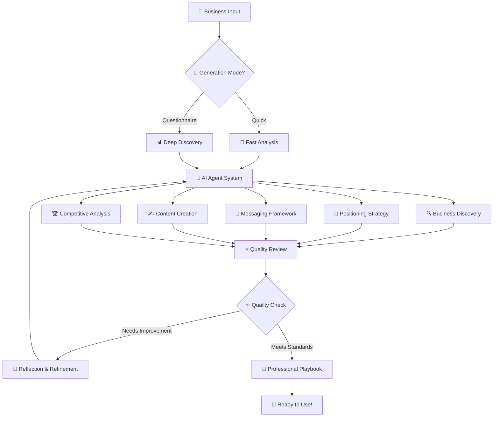

# 🎯 How MessageCraft Works

> **Transform your business description into powerful, professional messaging that converts customers and drives growth.**

---

## 🌟 The Magic Behind MessageCraft

MessageCraft uses cutting-edge **AI multi-agent systems** to analyze your business and create comprehensive messaging strategies that would typically cost thousands of dollars and take weeks to develop.

### ✨ **Two Powerful Generation Modes**

<table>
<tr>
<td width="50%">

### 🚀 **Quick Generation**
*Perfect for getting started fast*

**⏱️ 2-3 minutes** | **📝 Simple input**

Just describe your business and let our AI agents do the rest. Great for:
- Testing the platform
- Basic messaging needs  
- Quick iterations
- Startup validation

</td>
<td width="50%">

### 🎯 **Discovery Questionnaire**
*Professional-grade messaging strategy*

**⏱️ 10-15 minutes** | **📊 31 strategic questions**

Deep-dive questionnaire covering all aspects of your business for maximum precision. Perfect for:
- Established businesses
- Complex positioning
- Competitive markets
- Premium results

</td>
</tr>
</table>

---

## 🤖 Our AI Agent System

MessageCraft employs **6 specialized AI agents** working in harmony, each with unique expertise:

### 🔍 **1. Business Discovery Agent**
- Analyzes your business model and value proposition
- Identifies core strengths and market opportunities  
- Maps customer pain points to your solutions
- Creates detailed business profile

### 🎯 **2. Positioning Strategist Agent**  
- Researches your competitive landscape
- Identifies unique differentiation opportunities
- Develops strategic market positioning
- Creates compelling value propositions

### 💬 **3. Messaging Framework Agent**
- Crafts core messaging pillars
- Develops tone and voice guidelines  
- Creates customer-centric language
- Builds emotional connection strategies

### ✍️ **4. Content Creation Agent**
- Generates ready-to-use marketing copy
- Creates social media content templates
- Writes email sequences and headlines
- Develops website messaging

### 🏆 **5. Competitive Analysis Agent**
- Analyzes competitor messaging strategies
- Identifies market gaps and opportunities
- Suggests differentiation tactics
- Provides competitive positioning advice

### ⭐ **6. Quality Review Agent**
- Reviews all generated content for quality
- Ensures consistency across all messaging
- Provides improvement recommendations
- Delivers professional-grade results

---

## 🔄 The Generation Process

### **Step 1: Input & Analysis** ⚡
```
Your Business Input → AI Processing → Strategic Analysis
```
- Describe your business or complete our questionnaire
- AI agents analyze your input across multiple dimensions
- System builds comprehensive business understanding

### **Step 2: Multi-Agent Collaboration** 🤝
```
6 AI Agents → Parallel Processing → Collaborative Refinement
```
- Each agent works on their specialized area
- Real-time collaboration and cross-validation
- Iterative improvement and quality assurance

### **Step 3: Quality Enhancement** ✨
```
Generated Content → Quality Review → Reflection & Improvement
```
- Quality Review Agent evaluates all content
- **Reflection system** improves messaging until it meets high standards
- Multiple rounds of refinement for premium results

### **Step 4: Professional Deliverable** 📄
```
Polished Content → Organized Playbook → Ready-to-Use Assets
```
- Comprehensive messaging playbook
- Copy-and-paste ready content
- Strategic recommendations and next steps

---

## 📊 What You Get

### 🎯 **Strategic Foundation**
- **Business Profile**: Complete analysis of your business model
- **Positioning Strategy**: How to position against competitors  
- **Target Audience**: Detailed customer personas and segments
- **Value Propositions**: Compelling reasons customers choose you

### 💬 **Messaging Framework**
- **Core Messages**: Key communication pillars
- **Tone & Voice**: Consistent brand personality
- **Emotional Hooks**: What resonates with your audience
- **Proof Points**: Supporting evidence and credibility

### ✍️ **Ready-to-Use Content**
- **Headlines**: Attention-grabbing titles for ads and pages
- **Social Media**: Posts for LinkedIn, Twitter, Facebook
- **Email Sequences**: Welcome series and nurture campaigns  
- **Website Copy**: Hero sections, about pages, and more

### 📈 **Competitive Intelligence**
- **Market Analysis**: Your position in the competitive landscape
- **Differentiation Strategy**: What makes you unique
- **Opportunity Gaps**: Unserved market segments
- **Competitive Advantages**: Your strongest selling points

---

## 🎨 Visual Process Flow



---

## 🌟 The MessageCraft Advantage

### **🧠 Intelligent Processing**
- **LangGraph Technology**: State-of-the-art AI orchestration
- **Reflection System**: Continuous quality improvement  
- **Multi-Agent Collaboration**: Specialized expertise in every area
- **Quality Scoring**: Measurable results with improvement suggestions

### **⚡ Speed & Efficiency**
- **Minutes, Not Weeks**: Get professional messaging in 2-15 minutes
- **Real-Time Generation**: Watch your playbook come to life
- **Instant Updates**: Make changes and regenerate instantly
- **Copy-Ready Content**: No additional writing needed

### **🎯 Professional Quality**
- **Agency-Level Results**: $10,000+ value for a fraction of the cost
- **Proven Frameworks**: Based on successful marketing strategies
- **Industry Expertise**: Works across all business types and industries
- **Scalable Solutions**: From startups to enterprises

### **🔒 Secure & Private**
- **Enterprise Security**: Your data is protected and never shared
- **Private Processing**: All analysis happens in secure environments
- **Data Ownership**: You own all generated content completely
- **Compliance Ready**: GDPR and SOC2 compliant infrastructure

---

## 🚀 Getting Started

### **1. Choose Your Path**
- **Quick Start**: Describe your business in a few sentences
- **Professional**: Complete our comprehensive discovery questionnaire

### **2. Watch the Magic** 
- Real-time progress tracking as AI agents work
- See each agent's contribution to your messaging strategy
- Quality scores and improvement suggestions

### **3. Get Your Playbook**
- Professional PDF download
- Copy-and-paste content library
- Strategic recommendations
- Implementation guidance

### **4. Implement & Grow**
- Use content across all marketing channels
- A/B test different messaging approaches  
- Refine based on market feedback
- Scale your messaging strategy

---

## 💡 **Success Stories**

> *"MessageCraft gave us messaging clarity that our agency couldn't deliver in 3 months. The AI understood our market better than we expected."*
> 
> **— Sarah Chen, CEO @ TechStart**

> *"The competitive analysis was spot-on. We found positioning opportunities we never considered. ROI was immediate."*
> 
> **— Marcus Johnson, CMO @ GrowthCorp**

> *"Professional-quality messaging in minutes. The content was so good, we used it verbatim on our homepage and saw 40% conversion improvement."*
> 
> **— Elena Rodriguez, Founder @ ScaleUp**

---

## 🎯 **Ready to Transform Your Messaging?**

**Join thousands of businesses** using MessageCraft to create powerful, converting messaging that drives real results.

### **✨ Start Your Journey**
1. **Sign Up**: Create your free account
2. **Generate**: Choose quick start or discovery questionnaire  
3. **Download**: Get your professional messaging playbook
4. **Implement**: Use your new messaging across all channels
5. **Grow**: Watch your business messaging drive real results

---

*MessageCraft: Where AI meets marketing strategy to create messaging that works.* 🚀