# 🏗️ MessageCraft System Architecture

> **A comprehensive look at how MessageCraft's AI-powered messaging platform works behind the scenes.**

---

## 🎯 High-Level System Overview

```mermaid
graph TB
    subgraph "🌐 Frontend Layer"
        UI[🎨 React Dashboard]
        FORMS[📝 Input Forms]
        DISPLAY[📄 Playbook Display]
    end
    
    subgraph "⚡ API Gateway"
        API[🚀 FastAPI Server]
        AUTH[🔐 Authentication]
        CORS[🌍 CORS Handler]
    end
    
    subgraph "🤖 AI Processing Layer"
        LANG[🧠 LangGraph Orchestrator]
        AGENTS[👥 Multi-Agent System]
        REFLECT[🔄 Reflection Engine]
    end
    
    subgraph "🗄️ Data Layer"
        DB[(📊 Supabase PostgreSQL)]
        CACHE[⚡ Query Cache]
        FILES[📁 Generated Assets]
    end
    
    subgraph "🔌 External Services"
        ANTHROPIC[🤖 Anthropic Claude API]
        STRIPE[💳 Stripe Payments]
        EMAIL[📧 Email Service]
    end
    
    UI --> API
    FORMS --> API
    DISPLAY --> API
    
    API --> AUTH
    API --> CORS
    API --> LANG
    
    LANG --> AGENTS
    AGENTS --> REFLECT
    AGENTS --> ANTHROPIC
    
    API --> DB
    API --> CACHE
    API --> FILES
    
    API --> STRIPE
    API --> EMAIL
    
    classDef frontend fill:#e1f5fe
    classDef api fill:#f3e5f5
    classDef ai fill:#e8f5e8
    classDef data fill:#fff3e0
    classDef external fill:#fce4ec
    
    class UI,FORMS,DISPLAY frontend
    class API,AUTH,CORS api
    class LANG,AGENTS,REFLECT ai
    class DB,CACHE,FILES data
    class ANTHROPIC,STRIPE,EMAIL external
```



---

## 🤖 AI Agent System Deep Dive

### **🧠 LangGraph Orchestration**

```mermaid
graph LR
    subgraph "🎯 Input Processing"
        INPUT[📝 Business Input]
        PARSE[🔍 Input Parser]
        VALIDATE[✅ Validation]
    end
    
    subgraph "👥 Agent Coordination"
        COORD[🎭 Agent Coordinator]
        STATE[📊 Shared State]
        QUEUE[⏳ Task Queue]
    end
    
    subgraph "🤖 AI Agents"
        DISC[🔍 Discovery Agent]
        POS[🎯 Positioning Agent]
        MSG[💬 Messaging Agent]
        CONT[✍️ Content Agent]
        COMP[🏆 Competitive Agent]
        QUAL[⭐ Quality Agent]
    end
    
    subgraph "🔄 Quality Control"
        REVIEW[📋 Quality Review]
        REFLECT[🤔 Reflection]
        IMPROVE[⬆️ Improvement]
    end
    
    INPUT --> PARSE
    PARSE --> VALIDATE
    VALIDATE --> COORD
    
    COORD --> STATE
    COORD --> QUEUE
    
    STATE --> DISC
    STATE --> POS
    STATE --> MSG
    STATE --> CONT
    STATE --> COMP
    
    DISC --> QUAL
    POS --> QUAL
    MSG --> QUAL
    CONT --> QUAL
    COMP --> QUAL
    
    QUAL --> REVIEW
    REVIEW --> REFLECT
    REFLECT --> IMPROVE
    IMPROVE --> COORD
```



### **🔄 Agent Workflow States**


---

## 🗄️ Database Schema & Relationships


---

## 🔐 Security Architecture

### **🛡️ Security Layers**

```mermaid
graph TD
    subgraph "🌐 Frontend Security"
        CSP[🛡️ Content Security Policy]
        XSS[🚫 XSS Protection]
        FRAME[🖼️ Frame Options]
    end
    
    subgraph "⚡ API Security"
        CORS_SEC[🌍 CORS Configuration]
        RATE[⏱️ Rate Limiting]
        AUTH_SEC[🔐 Token Authentication]
        VALID[✅ Input Validation]
    end
    
    subgraph "🗄️ Database Security"
        RLS[🔒 Row Level Security]
        ENCRYPT[🔐 Data Encryption]
        BACKUP[💾 Secure Backups]
    end
    
    subgraph "🔌 External Security"
        API_KEYS[🗝️ API Key Management]
        TLS[🔒 TLS/SSL Encryption]
        VAULT[🏦 Secret Management]
    end
    
    CSP --> CORS_SEC
    XSS --> CORS_SEC
    FRAME --> CORS_SEC
    
    CORS_SEC --> RLS
    RATE --> RLS
    AUTH_SEC --> RLS
    VALID --> RLS
    
    RLS --> API_KEYS
    ENCRYPT --> API_KEYS
    BACKUP --> API_KEYS
    
    API_KEYS --> TLS
    TLS --> VAULT
```



---

## 🚀 Deployment Architecture

### **☁️ Railway Cloud Deployment**

```mermaid
graph TB
    subgraph "🌍 CDN & Load Balancing"
        CDN[🌐 Global CDN]
        LB[⚖️ Load Balancer]
    end
    
    subgraph "🎨 Frontend Service"
        NGINX[🔧 Nginx Server]
        STATIC[📁 Static Assets]
        SPA[🔄 SPA Routing]
    end
    
    subgraph "⚡ Backend Service"
        UVICORN[🚀 Uvicorn Server]
        FASTAPI[⚡ FastAPI App]
        WORKERS[👥 Worker Processes]
    end
    
    subgraph "🗄️ Database Service"
        SUPABASE[📊 Supabase PostgreSQL]
        REALTIME[⚡ Realtime Updates]
        AUTH_DB[🔐 Auth Service]
    end
    
    subgraph "🔍 Monitoring"
        LOGS[📋 Application Logs]
        METRICS[📈 Performance Metrics]
        ALERTS[🚨 Error Alerts]
    end
    
    CDN --> LB
    LB --> NGINX
    LB --> UVICORN
    
    NGINX --> STATIC
    NGINX --> SPA
    
    UVICORN --> FASTAPI
    FASTAPI --> WORKERS
    
    FASTAPI --> SUPABASE
    FASTAPI --> REALTIME
    FASTAPI --> AUTH_DB
    
    FASTAPI --> LOGS
    NGINX --> LOGS
    LOGS --> METRICS
    METRICS --> ALERTS
```



---

## 📊 Data Flow Architecture

### **🔄 Request Processing Flow**

```mermaid
sequenceDiagram
    participant U as 👤 User
    participant F as 🎨 Frontend
    participant A as ⚡ API
    participant AG as 🤖 AI Agents
    participant D as 🗄️ Database
    participant C as 🧠 Claude API
    
    U->>F: Submit Business Info
    F->>A: POST /generate-playbook
    A->>D: Save Session
    A->>AG: Initialize Agents
    
    AG->>C: Business Analysis
    C->>AG: Analysis Results
    AG->>C: Positioning Strategy
    C->>AG: Strategy Results
    AG->>C: Content Generation
    C->>AG: Content Results
    
    AG->>AG: Quality Review
    AG->>AG: Reflection Process
    AG->>D: Save Results
    
    A->>F: Generation Complete
    F->>A: GET /playbook/{id}
    A->>D: Fetch Results
    D->>A: Playbook Data
    A->>F: Formatted Playbook
    F->>U: Display Results
```



### **⚡ Real-time Progress Updates**

```mermaid
sequenceDiagram
    participant F as 🎨 Frontend
    participant A as ⚡ API
    participant AG as 🤖 Agents
    participant P as 📡 Polling
    
    F->>A: Start Generation
    A->>AG: Begin Processing
    
    loop Every 3 seconds
        F->>P: Poll Status
        P->>A: GET /status/{id}
        A->>AG: Check Progress
        AG->>A: Current Status
        A->>P: Status Response
        P->>F: Update Progress
    end
    
    AG->>A: Complete!
    A->>F: Final Results
```



---

## 🔧 Technology Stack

### **🎨 Frontend Technologies**
```yaml
Framework: React 18 with Vite
Styling: TailwindCSS with custom components
State: React Query + Context API
Routing: React Router v6
Forms: React Hook Form
Animations: Framer Motion
Icons: Heroicons
Notifications: React Hot Toast
```

### **⚡ Backend Technologies**
```yaml
Framework: FastAPI with Python 3.12
AI Orchestration: LangGraph
AI Provider: Anthropic Claude
Database: Supabase PostgreSQL
Authentication: JWT + Row Level Security
Validation: Pydantic models
Async: AsyncIO + Uvicorn
Testing: Pytest
```

### **🗄️ Data & Infrastructure**
```yaml
Database: PostgreSQL with JSONB
Caching: React Query + Browser cache
File Storage: Supabase Storage
Deployment: Railway with Docker
Monitoring: Railway built-in logs
CDN: Railway global CDN
SSL: Automatic HTTPS
```

---

## 📈 Performance Optimizations

### **⚡ Frontend Optimizations**
- **Code Splitting**: Lazy loading for routes
- **Asset Optimization**: Compressed images and fonts
- **Caching Strategy**: Long-term caching for static assets
- **Bundle Analysis**: Optimized dependency tree

### **🚀 Backend Optimizations**  
- **Connection Pooling**: Efficient database connections
- **Async Processing**: Non-blocking AI generation
- **Response Compression**: Gzip for all text responses
- **Query Optimization**: Indexed database queries

### **🗄️ Database Optimizations**
- **Indexing Strategy**: Optimized for common queries
- **JSONB Storage**: Efficient nested data storage
- **Row Level Security**: Secure multi-tenant access
- **Connection Management**: Pooled connections

---

## 🔍 Monitoring & Observability

### **📊 Key Metrics**
- **Response Time**: API endpoint performance
- **Generation Success Rate**: AI processing reliability  
- **User Engagement**: Dashboard usage patterns
- **Error Rates**: System stability monitoring

### **🚨 Alerting**
- **API Downtime**: Immediate notifications
- **Database Issues**: Connection and query problems
- **AI Service Errors**: Generation failures
- **Performance Degradation**: Slow response times

### **📋 Logging Strategy**
- **Structured Logs**: JSON format for easy parsing
- **Request Tracing**: Full request lifecycle tracking
- **Error Context**: Detailed error information
- **Performance Metrics**: Response time tracking

---

This architecture ensures **MessageCraft** is scalable, secure, and maintainable while delivering exceptional user experience and reliable AI-powered messaging generation. 🚀